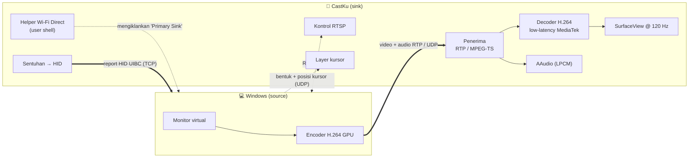
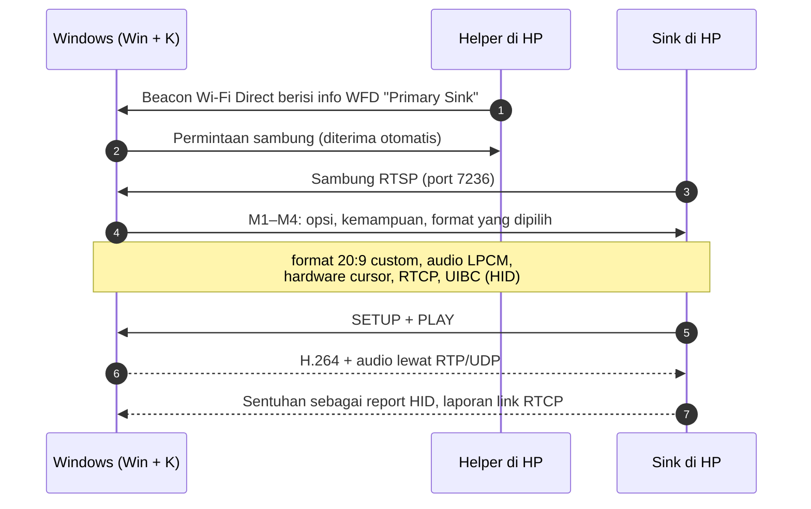

<p align="center">
  
</p>

<p align="center">
  <a href="#-fitur">Fitur</a> ·
  <a href="#-cara-kerja">Cara kerja</a> ·
  <a href="#-instalasi">Instalasi</a> ·
  <a href="#-cara-pakai">Cara pakai</a> ·
  <a href="#-build-dari-source">Build</a> ·
  <a href="#-rencana">Rencana</a>
</p>

<p align="center">
  
  
  
  
  
  
  
</p>

<p align="center">
  <a href="README.md">English</a> · <b>Bahasa Indonesia</b>
</p>

---

**CastKu** mengubah HP Android menjadi **layar kedua nirkabel untuk Windows**, persis seperti fitur *Second Screen* di Samsung Galaxy Tab. Buka aplikasinya, tekan **Win + K** di laptop, pilih HP Anda, dan desktop Windows langsung diperluas ke HP. Tanpa software di PC, tanpa driver, tanpa root.

HP menjadi penerima Wi-Fi Display (kompatibel Miracast) sungguhan. Windows yang menangkap layar dan meng-encode dengan GPU, lalu HP men-decode dengan hardware dan langsung menampilkannya. Sentuhan di HP mengontrol PC, dan suara PC keluar dari HP.

> Dibuat dan dioptimalkan di **Xiaomi 17T** (MediaTek Dimensity, HyperOS 3, Android 16). HP Android lain yang cukup baru mungkin juga bisa; lihat [Kompatibilitas](#-kompatibilitas).

---

## ✨ Fitur

| | Fitur | Keterangan |
|:-:|---|---|
| 🖥️ | **Cast langsung dari Win + K** | Muncul di panel Cast bawaan Windows seperti TV atau Galaxy Tab. Mode *Extend*, *Duplicate* dan *Second screen only* semuanya jalan. |
| ⚡ | **Latensi rendah** | Pipeline tanpa buffer ke decoder hardware low-latency MediaTek. Frame di-decode begitu paket terakhirnya tiba (memakai penanda akhir-frame dari Windows). |
| 📐 | **Resolusi 20:9 native** | Meminta Windows membuat desktop seukuran layar HP (bawaan 2176 × 1000 @ 60 fps), bukan gambar 16:9 dengan bar hitam. |
| 🖐️ | **Sentuhan ke PC** | Tiga mode: layar sentuh multi-touch, pointer mengikuti jari, atau touchpad seperti laptop. |
| 🖱️ | **Hardware cursor** | Pointer mouse PC digambar sendiri oleh HP, tidak lewat antrean video, jadi tetap responsif. |
| 🔊 | **Audio di HP** | Suara PC diputar di HP lewat jalur audio low-latency (buffer sekitar 10 ms). |
| 📶 | **Bitrate adaptif** | Mengirim laporan kualitas link sehingga Windows menaikkan bitrate saat koneksi bersih dan menurunkannya saat ramai. |
| 🔒 | **Tanpa root** | Memakai user shell Android (lewat USB debugging atau Shizuku) untuk satu panggilan khusus yang dibutuhkan. |

---

## 📊 Performa terukur

Diukur di Xiaomi 17T dan laptop Windows 11 (Intel Wi-Fi 7) pada jaringan 5 GHz yang sama.

| Metrik | Hasil |
|---|---|
| Frame rate | 58–60 fps (Windows hanya mengirim frame saat ada perubahan) |
| Paket → tampil (sisi HP) | rata-rata 9–14 ms |
| Paket hilang / frame di-drop | 0 / 0 dalam sesi beberapa menit |
| Buffer audio | burst 256 frame, buffer 512 frame (≈ 10,7 ms) |
| Sambung ulang | Lancar tanpa restart aplikasi |

Latensi total juga mencakup encoder Windows dan link Wi-Fi, jadi perkiraannya sekitar **40–70 ms dari layar ke layar**, setara dengan receiver Miracast komersial.

---

## 🧠 Cara kerja



Urutan satu sesi Wi-Fi Display:



**Satu kunci yang membuatnya mungkin.** Agar muncul di Win + K, HP harus diiklankan sebagai sink Wi-Fi Display (`WifiP2pManager.setWfdInfo`). Android hanya mengizinkannya dengan permission `CONFIGURE_WIFI_DISPLAY`, yang tidak bisa didapat aplikasi biasa tetapi sudah dimiliki **user shell** Android. Karena itu CastKu menjalankan helper kecil sebagai user shell (dinyalakan lewat USB debugging atau Shizuku, cara yang sama dipakai scrcpy) untuk mengurus Wi-Fi Direct. Sisanya aplikasi biasa.

**Ekstensi Windows yang diimplementasikan** (dari spesifikasi protokol terbuka Microsoft, MS-WFDPE dan MS-WDHCE):

- `microsoft_custom_video_formats` untuk resolusi seukuran layar HP
- Hardware cursor, penanda akhir-frame, permintaan IDR
- Laporan RTCP untuk adaptasi bitrate
- Manajemen latensi
- UIBC dengan perangkat HID untuk sentuhan dan keyboard

---

## 📦 Instalasi

> **Rilis pratinjau.** Diuji di satu HP (Xiaomi 17T, HyperOS 3). APK ditandatangani dengan debug key.

**Yang dibutuhkan:** PC Windows 10/11 yang mendukung Miracast (kebanyakan laptop), Android 12 atau lebih baru (arm64), USB debugging, dan [platform-tools](https://developer.android.com/tools/releases/platform-tools) (`adb`) di PC.

1. Unduh `CastKu-1.0.0-arm64.apk` dari [Releases](../../releases).
2. Di HP, aktifkan **Opsi pengembang → USB debugging**. Di HP Xiaomi/HyperOS aktifkan juga **USB debugging (Security settings)** dan **Install via USB**.
3. Pasang APK: `adb install CastKu-1.0.0-arm64.apk` (tekan **Install** di HP bila HyperOS meminta).
4. Jalankan helper (sekali setiap HP restart):
   - **Dari PC:** jalankan `scripts\start-helper.bat` (Windows) atau `scripts/start-helper.sh` (macOS/Linux).
   - **Tanpa PC:** pasang [Shizuku](https://shizuku.rikka.app/), nyalakan lewat Wireless debugging, lalu tekan **Jalankan helper** di aplikasi.

---

## 🚀 Cara pakai

1. Buka **CastKu** di HP lalu tekan **Aktifkan**. Status berubah menjadi **Siap dicast**.
2. Di PC tekan **Win + K** lalu pilih HP Anda.
3. Tekan **Win + P** untuk berpindah antara **Extend**, **Duplicate** dan **Second screen only**.
4. Untuk memutus, gesek kembali dua kali di HP atau pilih **Disconnect** di Windows.

### 🖐️ Mode sentuh

Pilih di aplikasi; berlaku mulai koneksi berikutnya.

| Mode | Perilaku |
|---|---|
| **Touchscreen** (bawaan) | Jari langsung menyentuh desktop Windows. Multi-touch, pinch-zoom, gesture sentuh Windows. |
| **Pointer ikut jari** | Pointer mouse melompat ke jari; tap = klik, geser = drag. |
| **Touchpad** | Satu jari menggerakkan pointer, tap = klik kiri, tap dua jari = klik kanan, geser dua jari = scroll, ketuk lalu tahan = drag. |

### 🎛️ Kualitas stream

| Mode | Resolusi | Refresh |
|---|---|---|
| **Smooth** (bawaan) | 2176 × 1000 | 60 fps |
| **Sharp** | 2752 × 1264 | 30 fps |
| **Ultra-fast** | 1536 × 704 | 120 fps |

Windows meng-encode H.264 di level 4.2 yang membatasi *resolusi × refresh*. Itu sebabnya mode paling tajam berjalan di 30 fps.

---

## 📶 Tips jaringan

- **Paling baik:** PC dan HP tersambung ke **Wi-Fi 5 GHz yang sama**. Wi-Fi Direct lalu memakai channel yang sama sehingga radio tidak perlu berpindah-pindah. Aplikasi memberi peringatan bila channel-nya berbeda.
- **Hotspot HP:** banyak chip Wi-Fi HP (termasuk Xiaomi 17T) **tidak bisa menjalankan hotspot dan Wi-Fi Direct bersamaan**. Aplikasi mendeteksi ini dan memberi tahu Anda. Berikan internet ke laptop lewat **USB tethering**, dan casting berjalan normal.
- Wi-Fi HP harus **menyala**. Tidak harus tersambung ke jaringan.

---

## 🔧 Kompatibilitas

| | Status |
|---|---|
| Xiaomi 17T · HyperOS 3 · Android 16 | ✅ Diuji penuh |
| HP Android 12+ lain | ⚠️ Belum diuji. Butuh chip Wi-Fi dengan Wi-Fi Direct; resolusi dioptimalkan untuk layar 20:9 |
| Windows 11 (24H2+) | ✅ Diuji |
| Windows 10 | ⚠️ Seharusnya jalan; resolusi custom 20:9 butuh build terbaru, kalau tidak Windows kembali ke 1080p |

---

## 🔨 Build dari source

Kebutuhan: JDK 17+ (JBR bawaan Android Studio bisa), Android SDK platform 37, NDK 30, CMake 4.1.

```bash
cd android
./gradlew assembleRelease
adb install -r app/build/outputs/apk/release/app-release.apk
```

```text
android/
├─ app/src/main/cpp/         Sink native (C++17)
│  ├─ rtsp_client            Negosiasi RTSP / Wi-Fi Display + ekstensi Microsoft
│  ├─ stream_receiver        RTP + demux MPEG-TS, deteksi paket hilang
│  ├─ video_decoder          Decoder low-latency AMediaCodec, input zero-copy
│  ├─ audio_player           Callback AAudio + ring buffer lock-free
│  ├─ uibc_client            Sentuhan / keyboard sebagai HID lewat UIBC
│  ├─ cursor_overlay         Hardware cursor di layer SurfaceControl
│  └─ rtcp_session           Laporan penerima RTCP
├─ app/src/main/java/        UI, foreground service, koneksi ke helper
└─ helper/src/main/java/     Helper Wi-Fi Direct (berjalan sebagai user shell)
scripts/                     start-helper.bat / start-helper.sh
```

---

## 🧭 Rencana

- [ ] **Mode Hotspot**: aplikasi pendamping kecil di Windows yang stream lewat hotspot HP (untuk saat Wi-Fi Direct tidak bisa jalan)
- [ ] Helper menyala otomatis setelah HP restart (Shizuku start-on-boot)
- [ ] Drag-lock touchpad dan kecepatan pointer yang bisa diatur
- [ ] Tekanan pena untuk HP dengan stylus
- [ ] Pengujian di lebih banyak HP dan chipset

---

## ⚠️ Keterbatasan

- Helper berhenti saat HP restart atau USB debugging dimatikan; nyalakan lagi (langkah 4 Instalasi).
- Windows 11 tidak lagi menampilkan tombol "Allow input" di panel Cast. Input diaktifkan otomatis.
- Konten yang dilindungi HDCP (sebagian aplikasi streaming) tidak ditampilkan.

---

## 📄 Lisensi

[MIT](LICENSE)

Xiaomi, HyperOS, Samsung, Galaxy, Windows dan Miracast adalah merek dagang milik pemiliknya masing-masing. Ini proyek independen, tidak berafiliasi dengan maupun didukung oleh pihak-pihak tersebut.
