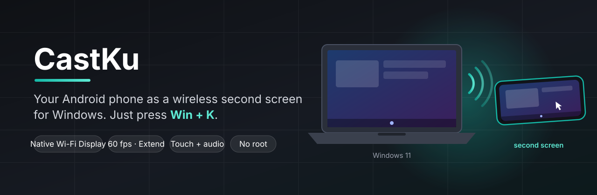
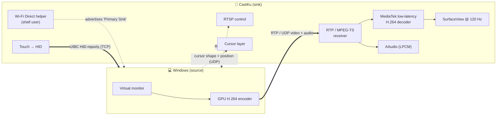
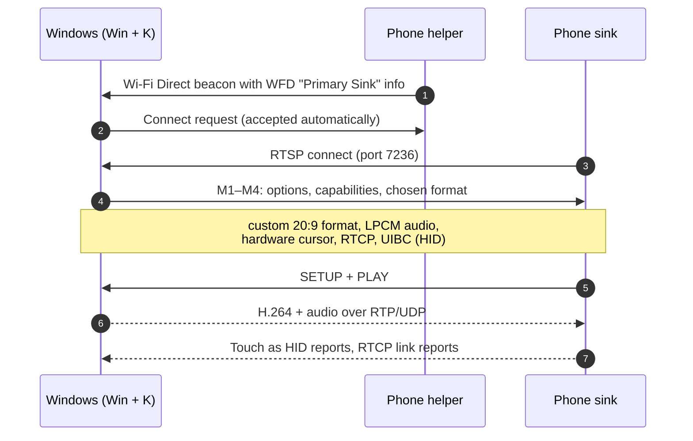

<p align="center">
  
</p>

<p align="center">
  <a href="#-features">Features</a> ·
  <a href="#-how-it-works">How it works</a> ·
  <a href="#-install">Install</a> ·
  <a href="#-how-to-use">How to use</a> ·
  <a href="#-build-from-source">Build</a> ·
  <a href="#-roadmap">Roadmap</a>
</p>

<p align="center">
  
  
  
  
  
  
</p>

<p align="center">
  <b>English</b> · <a href="README.id.md">Bahasa Indonesia</a>
</p>

---

**CastKu** turns an Android phone into a **wireless second screen for Windows**, the way *Second Screen* works on Samsung Galaxy Tab. Open the app, press **Win + K** on the laptop, pick your phone, and Windows extends the desktop onto it. No PC software, no driver, no root.

The phone becomes a real Wi-Fi Display (Miracast-compatible) receiver: Windows does the screen capture and hardware encoding, the phone decodes in hardware and renders straight to the display. Touch on the phone controls the PC, and the PC's sound plays on the phone.

> Built and tuned on a **Xiaomi 17T** (MediaTek Dimensity, HyperOS 3, Android 16). Other recent Android phones may work; see [Compatibility](#-compatibility).

---

## ✨ Features

| | Feature | Details |
|:-:|---|---|
| 🖥️ | **Native Win + K casting** | Shows up in Windows' own Cast panel like a TV or a Galaxy Tab. *Extend*, *Duplicate* and *Second screen only* all work. |
| ⚡ | **Low latency** | Zero-buffer pipeline into the MediaTek low-latency hardware decoder. Frames are decoded the moment their last packet lands (Windows' end-of-frame marker). |
| 📐 | **Native 20:9 resolution** | Asks Windows for a phone-shaped desktop (2176 × 1000 at 60 fps by default) instead of a letterboxed 16:9 image. |
| 🖐️ | **Touch back to the PC** | Three modes: real multi-touch screen, pointer that follows your finger, or laptop-style touchpad. |
| 🖱️ | **Hardware cursor** | The PC's mouse pointer is drawn by the phone itself, bypassing the video pipeline, so it stays responsive. |
| 🔊 | **Audio on the phone** | The PC's sound plays on the phone through a low-latency audio path (about 10 ms of buffering). |
| 📶 | **Adaptive bitrate** | Sends link-quality reports so Windows raises the bitrate on a clean connection and backs off on a noisy one. |
| 🔒 | **No root** | Uses Android's shell user (via USB debugging or Shizuku) for the one privileged call it needs. |

---

## 📊 Measured performance

Measured on a Xiaomi 17T and a Windows 11 laptop (Intel Wi-Fi 7) on the same 5 GHz network.

| Metric | Result |
|---|---|
| Frame rate | 58–60 fps (Windows only sends frames when something changes) |
| Packet → displayed (phone side) | 9–14 ms average |
| Packet loss / dropped frames | 0 / 0 over multi-minute sessions |
| Audio buffer | 256-frame bursts, 512-frame buffer (≈ 10.7 ms) |
| Reconnects | Clean, without restarting the app |

End-to-end latency also includes Windows' own encoder and the Wi-Fi link, so expect roughly **40–70 ms glass-to-glass**, in the same range as commercial Miracast receivers.

---

## 🧠 How it works



A Wi-Fi Display session goes through these steps:



**The one trick that makes it possible.** Being listed in Win + K requires advertising the phone as a Wi-Fi Display sink (`WifiP2pManager.setWfdInfo`). Android only allows that with `CONFIGURE_WIFI_DISPLAY`, a permission normal apps cannot get but Android's **shell user** already has. CastKu therefore runs a tiny helper as the shell user (started over USB debugging or Shizuku, the same approach scrcpy uses) that handles Wi-Fi Direct. Everything else is a normal app.

**Windows extensions it implements** (from Microsoft's open protocol specs MS-WFDPE and MS-WDHCE):

- `microsoft_custom_video_formats` for the phone-shaped resolution
- Hardware cursor, end-of-frame marker, IDR requests
- RTCP receiver reports for bitrate adaptation
- Latency management
- UIBC with HID devices for touch and keyboard

---

## 📦 Install

> **Preview release.** Tested on one phone (Xiaomi 17T, HyperOS 3). The APK is signed with a debug key.

**You need:** a Windows 10/11 PC with Miracast support (most laptops), Android 12 or newer (arm64), USB debugging, and the PC's [platform-tools](https://developer.android.com/tools/releases/platform-tools) (`adb`).

1. Download `CastKu-1.0.0-arm64.apk` from [Releases](../../releases).
2. On the phone, enable **Developer options → USB debugging**. On Xiaomi/HyperOS phones also enable **USB debugging (Security settings)** and **Install via USB**.
3. Install the APK: `adb install CastKu-1.0.0-arm64.apk` (tap **Install** on the phone if HyperOS asks).
4. Start the helper (needed once after every phone reboot):
   - **From a PC:** run `scripts\start-helper.bat` (Windows) or `scripts/start-helper.sh` (macOS/Linux).
   - **Without a PC:** install [Shizuku](https://shizuku.rikka.app/), start it with Wireless debugging, then tap **Jalankan helper** in the app.

---

## 🚀 How to use

1. Open **CastKu** on the phone and tap **Aktifkan**. The status changes to **Siap dicast**.
2. On the PC press **Win + K** and choose your phone.
3. Press **Win + P** to switch between **Extend**, **Duplicate** and **Second screen only**.
4. To disconnect, swipe back twice on the phone or choose **Disconnect** in Windows.

### 🖐️ Touch modes

Pick one in the app; it applies from the next connection.

| Mode | Behaviour |
|---|---|
| **Touchscreen** (default) | Your finger touches the Windows desktop directly. Multi-touch, pinch-zoom, Windows touch gestures. |
| **Pointer follows finger** | The mouse pointer jumps to your finger; tap = click, drag = drag. |
| **Touchpad** | One finger moves the pointer, tap = left click, two-finger tap = right click, two-finger drag = scroll, tap-then-hold = drag. |

### 🎛️ Stream quality

| Mode | Resolution | Refresh |
|---|---|---|
| **Smooth** (default) | 2176 × 1000 | 60 fps |
| **Sharp** | 2752 × 1264 | 30 fps |
| **Ultra-fast** | 1536 × 704 | 120 fps |

Windows encodes H.264 at level 4.2, which caps *resolution × refresh*. That is why the sharpest mode runs at 30 fps.

---

## 📶 Network tips

- **Best:** the PC and the phone on the **same 5 GHz Wi-Fi network**. Wi-Fi Direct then shares that channel and the radio never has to hop. The app warns you when the two channels differ.
- **Phone hotspot:** many phone Wi-Fi chips (including the Xiaomi 17T's) **cannot run a hotspot and Wi-Fi Direct at the same time**. The app detects this and tells you. Give the laptop internet over **USB tethering** instead and casting works normally.
- Wi-Fi must be **on** on the phone. It does not have to be connected to a network.

---

## 🔧 Compatibility

| | Status |
|---|---|
| Xiaomi 17T · HyperOS 3 · Android 16 | ✅ Fully tested |
| Other Android 12+ phones | ⚠️ Untested. Needs a Wi-Fi chip with Wi-Fi Direct; resolutions are tuned for 20:9 screens |
| Windows 11 (24H2+) | ✅ Tested |
| Windows 10 | ⚠️ Should work; custom 20:9 resolution needs a recent build, otherwise Windows falls back to 1080p |

---

## 🔨 Build from source

Requirements: JDK 17+ (Android Studio's bundled JBR works), Android SDK with platform 37, NDK 30, CMake 4.1.

```bash
cd android
./gradlew assembleRelease
adb install -r app/build/outputs/apk/release/app-release.apk
```

```text
android/
├─ app/src/main/cpp/         Native sink (C++17)
│  ├─ rtsp_client            RTSP / Wi-Fi Display negotiation + Microsoft extensions
│  ├─ stream_receiver        RTP + MPEG-TS demux, loss detection
│  ├─ video_decoder          AMediaCodec low-latency decoder, zero-copy input
│  ├─ audio_player           AAudio callback + lock-free ring buffer
│  ├─ uibc_client            Touch / keyboard as HID over UIBC
│  ├─ cursor_overlay         Hardware cursor on a SurfaceControl layer
│  └─ rtcp_session           RTCP receiver reports
├─ app/src/main/java/        UI, foreground service, helper link
└─ helper/src/main/java/     Wi-Fi Direct helper (runs as the shell user)
scripts/                     start-helper.bat / start-helper.sh
```

---

## 🧭 Roadmap

- [ ] **Hotspot mode**: a small Windows companion app that streams over the phone's hotspot link (for when Wi-Fi Direct can't run)
- [ ] Start the helper automatically after reboot (Shizuku start-on-boot)
- [ ] Touchpad drag-lock and adjustable pointer speed
- [ ] Pen pressure for phones with a stylus
- [ ] Tests on more phones and chipsets

---

## ⚠️ Known limitations

- The helper stops when the phone reboots or USB debugging is turned off; start it again (step 4 of Install).
- Windows 11 no longer shows an "Allow input" switch in the Cast panel. Input is enabled automatically.
- Content protected with HDCP (some streaming apps) is not shown.

---

## 📄 License

[MIT](LICENSE)

Xiaomi, HyperOS, Samsung, Galaxy, Windows and Miracast are trademarks of their respective owners. This is an independent project, not affiliated with or endorsed by any of them.
